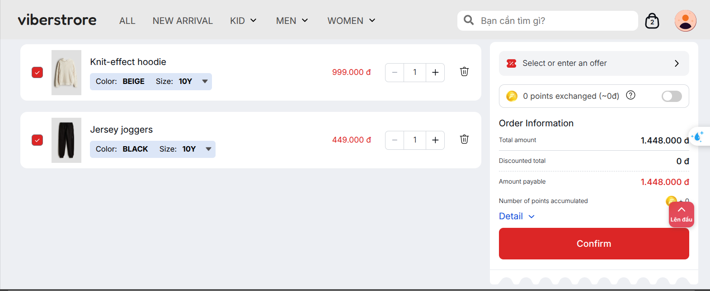

# ViberStore



ViberStore là một dự án e-commerce thời trang với:

- `frontend/`: React app cho khách hàng
- `admin/`: React app cho quản trị
- `backend/`: Django REST API
- `mysql`: dữ liệu chính
- `redis`: cache / broker groundwork
- `nginx`: reverse proxy đứng trước toàn hệ thống

README này phản ánh trạng thái hiện tại của repo và cấu hình Docker Compose mới.

## Kiến trúc

Hệ thống chạy theo mô hình một entrypoint duy nhất qua `nginx`:

- `/` -> frontend
- `/dashboard/` -> admin React app
- `/admin/` -> Django admin
- `/api/` -> Django API
- `/media/` -> user-uploaded files
- `/django-static/` -> Django static files

Lưu ý:

- React build assets vẫn dùng `/static/...`
- Django static đã được tách sang `/django-static/...` để tránh xung đột namespace

## Công nghệ chính

- Backend: Django, Django REST Framework
- Frontend/Admin: React
- Database: MySQL 8
- Cache/Broker: Redis
- Reverse proxy: Nginx
- Containerization: Docker, Docker Compose
- Payment: VNPay sandbox/live config qua env

## Cấu trúc thư mục

```text
.
├── admin/                  # Admin React app
├── backend/                # Django project
├── frontend/               # Customer-facing React app
├── initial_data/           # MySQL bootstrap SQL + init scripts
├── mysql_custom_conf/      # MySQL custom config
├── nginx/                  # Nginx reverse proxy config
├── docker-compose.yml
├── .env
└── setup.sh
```

## Yêu cầu

- Docker
- Docker Compose plugin (`docker compose`)

Nếu máy chưa có Docker, có thể dùng script:

```bash
./setup.sh --install-docker
```

## Cấu hình môi trường

Repo dùng 3 lớp env:

1. Root `.env`
   Dùng cho `docker-compose`, backend và MySQL.

2. `frontend/.env`
   Build-time env cho React frontend.

3. `admin/.env`
   Build-time env cho React admin.

### Root `.env`

Các biến quan trọng nhất:

- `APP_HOST`
- `APP_SCHEME`
- `DJANGO_SECRET_KEY`
- `DJANGO_DEBUG`
- `MYSQL_*`
- `EMAIL_*`
- `VNPAY_*`
- `ADMIN_EMAIL`
- `ADMIN_PASSWORD`

Thiết kế hiện tại cho phép bạn chỉ cần đổi IP/domain ở một chỗ:

```env
APP_HOST=192.168.10.43
APP_SCHEME=http
```

Django sẽ tự suy ra:

- `ALLOWED_HOSTS`
- `FRONTEND_ORIGIN`
- `ADMIN_ORIGIN`
- `VNPAY_RETURN_URL` nếu bạn không override riêng

### Frontend/Admin env

Hiện tại cả `frontend/.env` và `admin/.env` đều tối giản:

```env
REACT_APP_API_BASE_URL=/api/v1
```

Nghĩa là frontend/admin gọi API qua reverse proxy thay vì gọi thẳng backend host:port.

## Chạy local bằng Docker

### Cách nhanh nhất

```bash
./setup.sh
```

Script sẽ:

- kiểm tra `.env` và `docker-compose.yml`
- cấp quyền cho script init MySQL
- tạo sẵn các thư mục bind mount cần thiết
- validate `docker compose config`
- build và start toàn bộ stack

### Chạy thủ công

```bash
docker compose up -d --build
```

Kiểm tra trạng thái:

```bash
docker compose ps
```

Xem log:

```bash
docker compose logs -f viberstore_nginx
docker compose logs -f viberstore_backend
docker compose logs -f viberstore_mysql
```

## URLs sau khi chạy

Giả sử `APP_HOST=192.168.10.43`:

- Frontend: `http://192.168.10.43/`
- Admin: `http://192.168.10.43/dashboard/`
- Django admin: `http://192.168.10.43/admin/`
- API root: `http://192.168.10.43/api/v1/`
- Swagger: `http://192.168.10.43/api/v1/swagger/schema`

## Flow khởi động

1. `viberstore_mysql` khởi động
2. MySQL import SQL từ `initial_data/`
3. script `initial_data/99_create_import_done_flag.sh` tạo file cờ hoàn tất import
4. healthcheck MySQL chuyển sang `healthy`
5. `viberstore_backend` khởi động, chờ MySQL sẵn sàng
6. backend chạy:
   - `makemigrations`
   - `collectstatic`
   - `create_admin`
   - `runserver`
7. `viberstore_nginx` nhận request và route đến frontend/admin/backend

## Dữ liệu khởi tạo

Thư mục `initial_data/` hiện chứa:

- `01_viberstore_structure_and_data.sql`
- `99_create_import_done_flag.sh`

Mục đích:

- bootstrap schema/data MySQL
- tạo cờ `initial_data_imported.flag` để healthcheck biết import đã xong

Lưu ý rất quan trọng:

- nếu volume MySQL đã tồn tại, MySQL sẽ không chạy lại toàn bộ `docker-entrypoint-initdb.d`
- nếu bạn muốn import lại từ đầu, cần reset volume

Ví dụ:

```bash
docker compose down -v
docker compose up -d --build
```

Lệnh trên sẽ xóa toàn bộ dữ liệu hiện có trong MySQL và Redis.

## Admin mặc định

Khi backend start, `entrypoint.sh` hiện đang gọi:

```bash
python manage.py create_admin
```

Nên nếu user admin chưa tồn tại, hệ thống sẽ tạo superuser theo:

- `ADMIN_EMAIL`
- `ADMIN_PASSWORD`

được cấu hình trong root `.env`.

## Migration và SQL dump

Repo hiện đang ở trạng thái vừa có:

- SQL bootstrap trong `initial_data/01_viberstore_structure_and_data.sql`
- Django migrations trong `backend/*/migrations`

Điều này có thể gây lệch giữa:

- schema đã có sẵn trong DB
- schema mà Django muốn tạo thêm qua `migrate`

Nếu gặp lỗi kiểu:

- `Duplicate column name ...`
- `Dependency on app with no migrations ...`

thì nguyên nhân thường là DB import từ SQL đã có schema trước rồi, trong khi Django migration tiếp tục muốn áp thêm thay đổi.

Khi làm việc với phần DB, nên xác định rõ một trong hai hướng:

1. SQL dump là nguồn sự thật, migrations được fake tương ứng
2. Django migrations là nguồn sự thật, SQL chỉ dùng cho seed data

## Các lệnh hay dùng

Recreate container sau khi sửa root `.env`:

```bash
docker compose up -d --force-recreate
```

Build lại frontend/admin sau khi sửa React code hoặc `frontend/.env`, `admin/.env`:

```bash
docker compose up -d --build viberstore_frontend viberstore_admin
```

Build lại backend sau khi sửa code backend hoặc Dockerfile:

```bash
docker compose up -d --build viberstore_backend
```

Vào shell backend:

```bash
docker compose exec viberstore_backend sh
```

Chạy migrate thủ công:

```bash
docker compose exec viberstore_backend python manage.py migrate
```

## VNPay sandbox

Các biến VNPay được lấy từ root `.env`.

Nếu test sandbox, cần kiểm tra:

- `VNPAY_PAYMENT_URL`
- `VNPAY_API_URL`
- `VNPAY_TMN_CODE`
- `VNPAY_HASH_SECRET_KEY`
- `VNPAY_RETURN_URL`

`VNPAY_RETURN_URL` mặc định sẽ được suy ra thành:

```text
${APP_SCHEME}://${APP_HOST}/payment
```

nếu bạn không cấu hình riêng.

## Troubleshooting

### 1. `DisallowedHost`

Nếu truy cập bằng IP LAN và Django báo:

```text
Invalid HTTP_HOST header
```

hãy kiểm tra lại:

- `APP_HOST`
- recreate backend:

```bash
docker compose up -d --force-recreate viberstore_backend
```

### 2. React assets 404 dưới `/static/...`

Đã được xử lý bằng cách:

- để React dùng `/static/...`
- chuyển Django static sang `/django-static/...`

Nếu vẫn lỗi, rebuild lại frontend và nginx.

### 3. MySQL `ready for connections` nhưng backend vẫn chờ

Thường do:

- healthcheck đang chờ file cờ import
- hoặc init SQL chưa hoàn tất

Kiểm tra:

```bash
docker compose logs -f viberstore_mysql
```

### 4. Docker Desktop báo `path is not shared`

Nếu project nằm dưới `/media/...` và Docker Desktop không mount được bind volume, hãy share thư mục project trong Docker Desktop File Sharing.

## Git workflow gợi ý

Nếu tách feature branch theo scope lớn:

- `feature/backend`
- `feature/deploy-docker`
- `feature/frontend`

Và merge tuần tự vào `develop`, sau đó merge `develop` vào `main` bằng merge commit riêng cho release.

## Ghi chú

- `backend/static/` là thư mục generated từ `collectstatic`
- `backend/media/` chứa file upload/media thực tế
- không nên commit `.env` thật cho production
- `runserver` hiện phù hợp cho dev/test hơn là production cứng